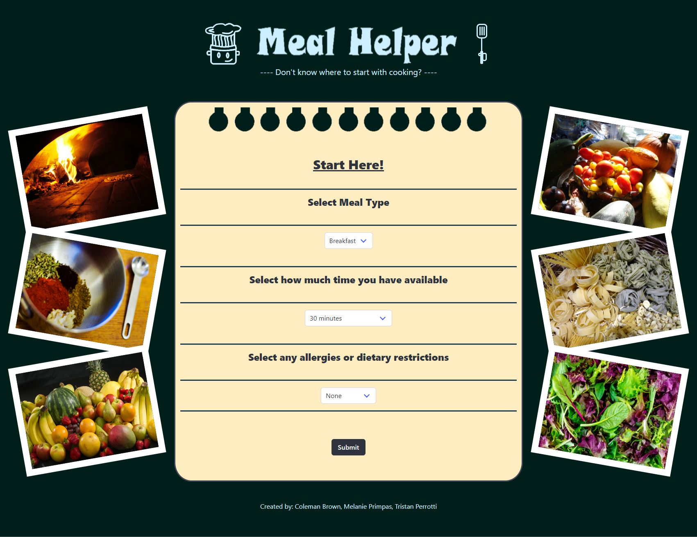
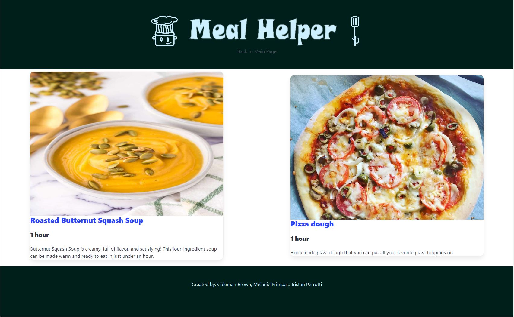

# meal-helper
This is an app to help new and aspiring chefs learn how to cook beginner level recipes.

Please use the link below to go to our site/app.

[Link](https://cbrow089.github.io/meal-helper/)

# User Story

AS AN inexperienced and aspiring chef,

I WANT an app that filters recipes based on time restraints and dietary restrictions,

SO THAT, I can easily find recipes custom to my needs.

## Acceptance Criteria
* It's done when a user can select breakfast, lunch or dinner from a drop down menu.

* It's done when a user can enter the time window that they have available.

* It's done when a user can enter if they have a food allergy or dietary restrictions.

* It's done when the website stores the user input into local storage and displays the input in a module for the user to confirm before proceeding.

* It's done when the website compiles a list of meals within the restrictions of the users input and provides a picture and link to the full recipe.

* It's done when a back button is displayed to clear the local storage and brings the user back to the origional input page.

* It's done when the app is successfully deployed to GitHub pages.

* It's done when the app is designed using a CCS framework.